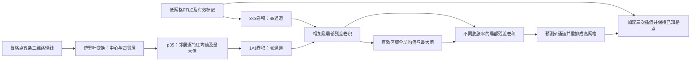

# P35如何连接FTLE超分辨：2.1的方法解释

> **2026-09-17撤销状态：** 本文涉及的Raw卷积＋FMT/残差或二维FMT卷积网络，已按用户要求从可用方案及有效FMT证据中删除；旧数值仅为撤销历史，不得用于当前主表、附录或“最佳FMT”结论。固定傅里叶特征本身及明确无卷积的Task1/Task4-c分支不受此撤销影响。以 [FMT禁止空间卷积协议1.1](FMT_no_spatial_convolution_protocol_1.1.md) 为准。

本文解释已冻结代码的输入和连接方式，不预设结果。完整比较由开发协议和最终测试记录决定，不能从分类成绩直接推断回归成绩。

## 从FTLE需要的信息出发

设流映射为Φ，积分时长为τ。FTLE（有限时间李雅普诺夫指数）为

`FTLE = log(σ_max(J)) / |τ|`，其中`J = ∂Φ/∂x₀`，`σ_max`是最大奇异值。

低网格上的一个FTLE标量只保留最大拉伸率，丢失了二维2×2形变矩阵中的方向和其他分量。不同形变可以给出相同FTLE，所以仅靠标量插值不能确定格点之间的真实形变。线簇提供的是更丰富的观测，并非傅里叶变换凭空创造信息。

本实验每个primitive严格为中心、±x、±y五条物质路径线，每条32个时刻。现有低FTLE使用同一四邻居的终点差分，中心线也已经存在于输入缓存。因而本实验是“同一批积分结果，只给网络标量或给它更丰富的几何表示”的比较。与只积分共享格点中心、再用相邻格点差分的传统预算不是同一种输入定义。若邻居偏移恰等于网格间距，还应去除重复粒子的积分成本，不能机械地把预算乘五。

## 为什么p35和保线身份频谱要分开检验

P35逐列计算四邻居描述量的均值、数值最大值，并与中心描述量、中心坐标/切向频谱连接。二维版本移除恒为零的三维三重积，得到102维；所有几何臂共同增加1维尺度，共103维。

这使不同邻居排列得到相同的汇总，但也会丢掉哪个方向对应哪个邻居。因此另设保留线身份的复数频谱对照，明确区分“概括共同和极端变形”与“保留方向信息”这两个作用。并非所有信息都应直接堆入一个更宽的向量，是否有收益必须用相同下游网络检验。

对一条向量步进序列`dₙ`，傅里叶零频系数为`Σdₙ`，也就是整段位移或相对变形。因此编码的零频确实包含末端形变；非零频描述过程。对同样终点的不同路径，非零频可能不同，但FTLE本身仍只由末端形变决定。这说明多时间窗只能作为待检验的辅助表示，不能从定义推出它必然提高FTLE精度。

实现对x、y两个实坐标分别保留6个非负频率的实部和虚部。它并未丢失这些频率对应的负频信息：若用复坐标`z=x+iy`，则`Z(k)=X(k)+iY(k)`，`Z(-k)=conj(X(k))+i conj(Y(k))`。两个实坐标的保留系数足以表达这两侧。高于所保留频率的分量被截断，不称为完整无损表示。

## 先在低网格融合，再上采样

网络将低FTLE和有效标记映射为48通道，同时将几何特征映射为48通道，相加后做残差卷积。pyramid候选使用膨胀率1、2、4、1的残差块，每块含两个3×3卷积；再加上输入和输出卷积，标量分支最大局部感受野为37×37个低网格点。每幅图的有效隐藏特征均值、最大值提供全场信息。U-Net候选则用两层下采样和对应的跳接作空间多尺度对照。

输出头生成s²个通道，使用像素重排变成s倍图像。训练目标是双三次插值的修正量；已知低网格节点直接保持原观测。高网格大小严格为`((H−1)s+1, (W−1)s+1)`，避免把节点数据误当作像素中心数据。所有新表示臂共用这些规则。

几何通道补零到同一宽度，保证各表示臂的参数形状和随机初始化相同，但活跃输入列数仍有差别。比较P35与Raw回答的是这套固定输入表示和归一化是否有利，不等于证明所有傅里叶编码都优于所有原始路径网络。

## 能够支持什么结论

相对旧ESPCN/U-Net的提升包含网络结构、残差训练等变化。相对同结构无几何的提升，才支持额外几何输入有用；相对同结构Raw的提升，进一步支持当前P35表示有用。保线身份频谱和多时间窗的对照用于判断更复杂的表示是否必要。

每个流场、倍率单独训练，但主结构和表示统一由四流场×两倍率的验证结果选择。三个新种子最终重训后才评价测试时间块；所有零增益、负增益和选择step0的运行保留。测试集历史上已经使用过，因此本轮只声明模型拟合和候选选择未读test，不声明整个研究开发过程拥有一个全新的确认集。

代码：`FMT_Utils/FTLE_P35_2D_2_1.py`、`FMT_Utils/FTLE_Fusion_2D_2_1.py`、`experiments/FTLE_P35_Fusion_2_1.py`；开发科学commit52ec9d8b。
