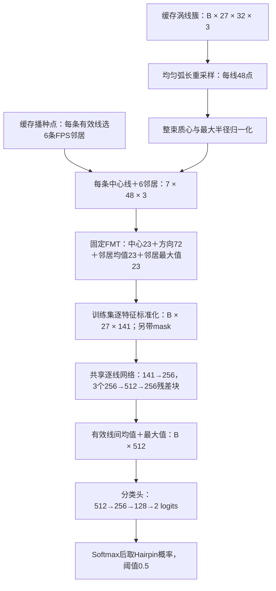

# Task4-c 当前最佳 FMT：c156 的参数、网络结构与复现说明

更新：2026-09-17。范围：`Ablation_Task4C_FPSAugmentSearch_1.1/1.2` 在固定 `BottomDensity_1.2` 数据上的搜索。

这里的“最佳”指：264个候选初筛后，前20个方案各用三个种子复核，按照**验证集平均F1**选出的FMT方案。它的三种子最终测试F1为 **0.920390 ± 0.003032**；最高一次测试为 **0.923741**。此前的 **0.933609 ± 0.008155 是复核验证分数**。

本文件说明已经完成的实现，不改变网络、数据、训练预算或历史结果。方法比较与结论以 `docs/experiment_log.md` 的 `task4c-fpsaug-final-20260917` 条目为准。

## 1. 一页参数表

| 项目 | 已执行设置 |
|---|---|
| 任务 | 输入三维涡线簇，输出 Hairpin / Non-hairpin 二分类；Hairpin为正类1 |
| 候选编号 | `c156` |
| 固定编码器 | FMT：项目中无可训练参数的傅里叶几何编码器 |
| FMT配方 | `p35`，每条中心线的六个邻居描述量逐特征求均值＋数值最大值 |
| 训练配置编号 | `h0`；本方案没有额外覆盖默认优化参数 |
| 可训练网络 | `wide_residual`，逐线共享的加宽残差多层感知机 |
| 每束有效线 | 10–27条，存储上补到27条；所有有效线均作为中心线编码 |
| 每条中心线的邻居 | 六条，按播种点做最远点采样（Farthest Point Sampling，FPS） |
| 每条线采样点数 | **48**，对已有32点折线按弧长均匀线性插值 |
| 傅里叶频率 | `k=0,1,2,3,4,5`，共6个频率，**包含直流分量k=0** |
| 每条中心线的FMT宽度 | 141维；另有1维有效线标记，不作为学习特征 |
| 几何归一化 | 整束所有有效采样点减质心，再除以最大半径 |
| 特征归一化 | 只用训练集有效线的逐特征均值、总体标准差做标准化 |
| 数据增强 | **无切向扰动、无旋转增强** |
| 学习率 / 权重衰减 | AdamW，`0.001 / 0.0001` |
| Dropout | `0.15` |
| 批大小 | 128个线簇 |
| 训练预算 | 最多500轮，验证模型选择连续50轮无改善则停止 |
| 判定阈值 | `P(Hairpin) >= 0.5` |
| 总可训练参数 | **992,386**；固定FMT编码器为0参数 |
| 最终测试种子 | `96721, 96722, 96723` |
| 实际硬件 | 每次训练使用一张 `Tesla V100-SXM2-32GB` |
| 平均训练时间 | **33.013分钟/次**，不包含数据准备与最终测试推理 |

## 2. 从线簇到分类结果

设批大小为B，一束有N条有效线，10≤N≤27。网络实际接收的张量保留27个线槽位，并用标记排除填充。



**有两次不同的均值＋最大值池化。** FMT内部对六条邻居的23维描述量池化，得到46维；可训练网络末端对整束N条有效线的256维表示池化，得到512维。二者的对象和位置不同。

### 2.1 FPS选线

每条有效线都轮流作为中心线。以它的播种点初始化已选集合，在其他有效播种点中，反复选择“到已选集合的最小欧氏距离最大”的点，直到选出六条邻居。已经选过的点、中心自身和填充线不参与下一次选择。距离相同时，按原缓存线索引取第一个。

距离使用缓存 `seeds.npy` 的float32坐标和原 `torch.cdist` 实现；训练、验证、测试使用同一规则。FPS只决定每条中心线的六邻居；**整束10–27条有效线均保留并被编码**。这些邻居索引进入固定FMT计算，不作为额外数值特征输入残差分类网络。

### 2.2 48点与几何归一化

沿原32点折线计算累积弧长，在全长上取48个等距位置，分段线性插值并保持两个端点。计算插值时用float64，结果转回float32。这个步骤没有重新积分，不恢复原32点缓存已经丢失的细节。

对重采样后的全部有效点计算：

\[
c=\frac{1}{48N}\sum_{i=1}^{N}\sum_{n=0}^{47}x_i[n],\qquad
R=\max_{i,n}\|x_i[n]-c\|_2,\qquad q_i[n]=\frac{x_i[n]-c}{R}.
\]

填充点不参与质心和半径计算，归一化后也保持为零。代码拒绝 `R <= 1e-12` 的退化输入。这里是**整束一次归一化**，没有为每个七线局部单元另算半径。

## 3. 141维FMT特征的准确构成

这里的序列轴是涡线上的点序号，不是物理时间；频率索引不能直接解释为Hz。离散傅里叶变换（Discrete Fourier Transform，DFT）保留前六个频率。

### 3.1 中心23维

对中心线构造47个三维步进向量：

\[
u_0[n]=q_0[n+1]-q_0[n],\quad n=0,\ldots,46.
\]

对47点向量序列做 `torch.fft.rfft`，默认归一化，即正变换不除以序列长度。设保留的复数向量为 `F_k=a_k+i b_k`，每个频率输出：

\[
\|a_k\|_2,\quad\|b_k\|_2,\quad
\frac{a_k^\top b_k}{\max(\|a_k\|_2\|b_k\|_2,10^{-8})},\quad k=0,\ldots,5.
\]

这18维后追加5个有符号归一化三重积：

\[
\frac{(a_k\times b_k)^\top a_{k+1}}
{\max(\|a_k\|_2\|b_k\|_2\|a_{k+1}\|_2,10^{-8})},\quad k=0,\ldots,4.
\]

合计23维。步进没有除以弧长或时间间隔。

### 3.2 方向频谱72维

对中心线构造单位切向：

\[
t[n]=\frac{q_0[n+1]-q_0[n]}{\max(\|q_0[n+1]-q_0[n]\|_2,10^{-12})},
\quad n=0,\ldots,46;\qquad t[47]=t[46].
\]

每点拼接三维坐标与三维单位切向，得到48×6序列。做 `rfft(..., norm='ortho')`，即使用正交归一化，保留六个频率的实部和虚部：`6频率 × 6通道 × 2 = 72维`。排列顺序为“频率、通道、实/虚”。

这72维保留坐标方向分量，整套141维编码不宣称旋转不变或时变参考系客观。

### 3.3 六邻居描述量变成46维

对邻居i构造相对位置及其变化：

\[
d_i[n]=q_i[n]-q_0[n],\qquad u_i[n]=d_i[n+1]-d_i[n].
\]

每条邻居的47点 `u_i` 经与中心相同的DFT和描述量运算，得到23维，六邻居组成6×23矩阵。当前实际调用固定 `neighbor_scale=1.0`、`neighbor_weight=1.0`、`mode='gram'`、`include_chirality=True`。

代码先对每一描述量列排序，再按p35对六个值求均值和**数值最大值**，得到23＋23维。最大值不是绝对值最大；排序不改变这两个统计量。不同列排序后的同一行不要求来自同一条物理邻居。

### 3.4 数组切片与标准化

| 左闭右开切片 | 含义 | 维数 |
|---|---|---:|
| `[0:23]` | 中心步进DFT描述量 | 23 |
| `[23:95]` | 中心坐标／单位切向的复数频谱 | 72 |
| `[95:118]` | 六邻居描述量逐特征均值 | 23 |
| `[118:141]` | 六邻居描述量逐特征数值最大值 | 23 |
| `[141]` | 有效线标记，1有效、0填充；不进入线性层 | 1 |

标准化是在以上141维拼接完成后进行。只用193,000个训练线簇中的 **3,637,354个有效线token** 统计每维均值和总体标准差，每个有效token等权。标准差小于 `1e-8` 时改为1。计算统计量与标准化减除时用float64，网络输入转为float32；填充线再置零，mask不标准化。

本方案无增强，因此只统计一份原训练输入。**没有带符号对数变换，没有[-8,8]裁剪。** 141维宽度包含15个理论固定零槽位，固定实现保留这些位置。无速度、curl、IVD估计、实例编号或标签附加输入。

## 4. 可训练网络的逐层结构

多层感知机（Multilayer Perceptron，MLP）在每条线之间共享同一组权重。LayerNorm表示在单条线或单个线簇的隐藏通道内做层归一化，并学习缩放与偏置；GELU（Gaussian Error Linear Unit）是高斯误差线性单元激活函数。

### 4.1 逐线网络：141 → 256

```text
每条有效线的141维标准化特征
  → Linear(141, 256)
  → LayerNorm(256)
  → GELU
  → Dropout(0.15)
  → ResidualBlock(256) × 3
  → 乘有效线mask

形状：[B, 27, 141] → [B, 27, 256]
```

每个残差块有独立权重，其结构为：

```text
ResidualBlock(x):
    r = LayerNorm(256)(x)
    r = Linear(256,512)(r)
    r = GELU(r)
    r = Dropout(0.15)(r)
    r = Linear(512,256)(r)
    r = Dropout(0.15)(r)
    return x + r
```

即 `output = x + block(x)`。相加后没有额外激活或归一化；下一个残差块从它自己的LayerNorm开始。全部Linear带偏置，LayerNorm有可训练缩放与偏置、`eps=1e-5`；GELU使用 `approximate='none'`。

### 4.2 整束池化：N × 256 → 512

设有效线表示为 `h_i ∈ R^256`：

\[
z=\operatorname{concat}\left(\frac{1}{N}\sum_{i=1}^N h_i,\;\max_{i=1}^N h_i\right)\in\mathbb R^{512}.
\]

最大值逐通道计算。均值除以实际有效线数N；最大值运算前把填充线对应值设为负无穷，保证填充不会改变结果。

### 4.3 分类头：512 → 256 → 128 → 2

```text
512维线簇表示
  → Linear(512,256) → LayerNorm(256) → GELU → Dropout(0.15)
  → Linear(256,128) → LayerNorm(128) → GELU → Dropout(0.15)
  → Linear(128,2)
  → 两个logits：[Non-hairpin, Hairpin]
```

模型本身返回logits，训练时直接送入交叉熵。推理时才做Softmax，并取第1类概率；概率≥0.5判为Hairpin。验证和测试时使用 `eval()`，关闭Dropout。

### 4.4 参数量拆分

| 模块 | 可训练参数 |
|---|---:|
| 固定FMT、几何归一化、训练集标准化、mask | 0 |
| 逐线入口 `Linear(141,256) + LayerNorm(256)` | 36,864 |
| 残差块1 | 263,424 |
| 残差块2 | 263,424 |
| 残差块3 | 263,424 |
| 整束均值＋最大值池化 | 0 |
| 分类头第一层 `Linear(512,256) + LayerNorm(256)` | 131,840 |
| 分类头第二层 `Linear(256,128) + LayerNorm(128)` | 33,152 |
| 输出层 `Linear(128,2)` | 258 |
| **合计** | **992,386** |

逐线网络合计827,136；分类头合计165,250。一个残差块为 `512 + 131,584 + 131,328 = 263,424`，分别对应LayerNorm、第一线性层、第二线性层。以上数字已从实际PyTorch对象的 `parameters()` 重新计数，包含所有偏置及归一化参数；实际前向形状也已检查。

## 5. 数据与划分

输入为Channel和TBL的三维瞬时流场涡量积分线簇，共用一个分类模型。数据版本为 `Ablation_Task4C_BottomDensity_1.2`，数据科学提交 `a7643890d22c7faf63c1f716bb6222ba5271c5ff`。

| 流场 | 集合 | 线簇数 | Hairpin | Non-hairpin |
|---|---|---:|---:|---:|
| Channel | 训练 | 98,500 | 44,410 | 54,090 |
| TBL | 训练 | 94,500 | 36,685 | 57,815 |
| Channel | 验证 | 1,500 | 267 | 1,233 |
| TBL | 验证 | 1,500 | 182 | 1,318 |
| Channel | 测试 | 5,000 | 1,075 | 3,925 |
| TBL | 测试 | 5,000 | 692 | 4,308 |

合计训练193,000、验证3,000、测试10,000。训练数据沿用底部Hairpin区域加密，验证与测试文件保持原样。划分共享头区、实例和源流场支撑；完整实例留出数为0，因此不能把它描述成未见Hairpin实例的独立泛化测试。

标签沿用冻结的整头候选区域规则：单个GT实例覆盖该候选头区至少50%则为正类，完整头区与GT无重叠则为负类，其余混合情况排除。本轮FMT搜索未重新标注。

缓存单向积分参数保持：

| 流场 | ds × maxiteration | 单向目标长度 |
|---|---|---|
| Channel | 0.001×80、0.002×50、0.004×30 | 0.08、0.10、0.12 |
| TBL | 0.025×160、0.05×100、0.04×150 | 4、5、6 |

以上是实际冻结缓存参数。当前方案在缓存折线上做32→48重采样，没有改变积分长度。

Ibex处理后数据目录：

```text
/ibex/user/zhanx0o/FMT_Task4C_BottomDensity_1p2_20260916/
  outputs/Ablation_Task4C_BottomDensity_1.2/physical/
    {channel,tbl}/{train,validation,test}/
      geometry.npy
      seeds.npy
      metadata.npz
```

`geometry.npy` 是最多27条×32点×3坐标；`seeds.npy` 用于FPS；`metadata.npz` 提供有效线数、监督标签和复核所需实例等元信息。标签与实例编号不作为网络输入。

## 6. 训练、选择与实际运行参数

| 项目 | 实际设置 |
|---|---|
| 优化器 | AdamW；全部网络参数采用同一个参数组 |
| 初始学习率 | `1e-3` |
| AdamW betas / eps | `(0.9,0.999)` / `1e-8` |
| 权重衰减 | `1e-4`，包括线性层、偏置及LayerNorm参数 |
| 其他AdamW设置 | `amsgrad=False`；`foreach=None`、`fused=None`沿用运行环境默认 |
| 损失 | 两类交叉熵，batch内mean归约；无类别权重、无标签平滑 |
| 采样 | 每轮所有193,000训练线簇随机排列一次，无放回；不做类别重采样 |
| batch / 梯度 | batch128，最后不足128的batch保留；每batch更新一次，无梯度累积 |
| 梯度裁剪 | 所有参数的梯度L2范数上限5；非有限梯度报错 |
| 学习率调度 | `ReduceLROnPlateau`，监测验证交叉熵；`mode=min`、`factor=0.5`、`patience=15` |
| 调度器其余设置 | `threshold=1e-4`、`threshold_mode=rel`、`cooldown=0`、`min_lr=1e-6`、`eps=1e-8` |
| 单次模型选择 | 每轮在完整验证集用固定阈值0.5计算F1；先比较F1，再比较平均精确率（Average Precision，AP） |
| 早停 | `(验证F1, 验证AP)`按上述顺序连续50轮未改善；最多500轮 |
| 选择候选方案 | 三个复核种子的平均验证F1，其次平均验证AP，再其次候选ID |
| 最终训练 | 选定方案后，用三个新种子从头训练；每次仍只用验证集选epoch，随后测试一次 |
| 初始化 | PyTorch模块默认初始化，`torch.manual_seed(seed)`；样本排列使用独立 `numpy.default_rng(seed)` |
| 精度 | 网络与FMT输出float32；几何插值、几何归一化和特征标准化部分用float64；无混合精度训练 |
| 确定性 | `torch.use_deterministic_algorithms(True)`，cuDNN deterministic开启、benchmark关闭，`CUBLAS_WORKSPACE_CONFIG=:4096:8` |
| 模型文件 | 最佳权重仅在内存保存并用于本次评估；未保留 `.pt/.pth/.ckpt` |

复核种子为 `96612,96613,96711`；最终种子为 `96721,96722,96723`。不能把复核与最终运行的分数或权重混用。

2026-09-17从同一Ibex环境只读核对：Python3.12.9、PyTorch2.6.0+cu118、CUDA运行时11.8、cuDNN90100、NumPy1.26.4。三个最终运行均报告Tesla V100-SXM2-32GB。

## 7. 最终F1与每个种子的明细

F1针对Hairpin正类：`F1 = 2TP / (2TP + FP + FN)`。每次合并Channel与TBL的10,000个测试样本计算一次F1，再跨三个种子求均值与样本标准差（`ddof=1`）。它不是两个流场F1的简单平均，也不是三个种子预测融合后的F1。

| 种子 | 验证选中epoch / 实际训练轮数 | 该次验证F1 | 合并测试F1 | Channel测试F1 | TBL测试F1 | 训练分钟 |
|---:|---:|---:|---:|---:|---:|---:|
| 96721 | 100 / 150 | 0.927697 | 0.923741 | 0.931002 | 0.912436 | 34.079 |
| 96722 | 73 / 123 | 0.932597 | 0.919592 | 0.925234 | 0.910920 | 27.634 |
| 96723 | 110 / 160 | 0.922732 | 0.917836 | 0.924618 | 0.907659 | 37.327 |
| 均值±样本标准差 | — | — | **0.920390±0.003032** | **0.926951±0.003521** | **0.910338±0.002441** | **均值33.013** |

| 种子 | TP：正确Hairpin | FP：误报Hairpin | FN：漏检Hairpin | TN：正确Non-hairpin | 测试精确率 | 测试召回率 |
|---:|---:|---:|---:|---:|---:|---:|
| 96721 | 1605 | 103 | 162 | 8130 | 0.939696 | 0.908319 |
| 96722 | 1624 | 141 | 143 | 8092 | 0.920113 | 0.919072 |
| 96723 | 1603 | 123 | 164 | 8110 | 0.928737 | 0.907187 |

数据准备与固定特征统计分别耗时11.610、11.809、11.686秒，未包含在上表训练分钟中；训练计时结束后才读取测试集。

学习率从0.001开始，以下为各次**首次使用减半后新学习率**的轮数，按顺序每次乘0.5：

| 种子 | 首次使用新学习率的epoch |
|---:|---|
| 96721 | 24、40、56、72、88、104、120、136 |
| 96722 | 37、53、69、85、101、117 |
| 96723 | 42、58、74、90、106、122、138、154 |

## 8. 代码与结果位置

| 内容 | 路径与入口 |
|---|---|
| 48点重采样、整束归一化、FMT组合 | `FMT_Utils/Task4C_FPSAugmentSearch_1_1.py`：`resample`、`normalize`、`fourier_tokens` |
| 可训练网络 | 同文件：`mlp`、`Residual`、`FourierClassifier`，选择 `architecture='wide_residual'` |
| FPS邻居 | `FMT_Utils/Task4C_NeighborSelection_1_1.py::neighbor_indices` |
| 23维DFT描述量 | `FMT_Utils/DFT_FMT_3D.py::pathline_dft_features_3d`、`dft_rotation_invariants_3d` |
| 72维方向频谱 | `FMT_Utils/FMT_P35_NormFrequency_3_1.py::direction_spectrum` |
| p35池化、h0定义 | `FMT_Utils/FMT_V8_Search_2_1.py::pool_neighbors`、`PROFILES` |
| 数据加载、标准化与完整训练循环 | `experiments/Task4C_FPSAugmentSearch_1_1.py::Dataset`、`fit_normalizer`、`standardize`、`train` |
| 前20名扩展与跨版本复用 | `experiments/Task4C_FPSAugmentSearch_1_2.py`；调用原训练函数，不改训练行为 |
| 搜索与训练参数 | `config/Ablation_Task4C_FPSAugmentSearch_1.1.json` |
| 前20名与运行调度设置 | `config/Ablation_Task4C_FPSAugmentSearch_1.2.json` |
| 物理缓存构建规则 | `config/Ablation_Task4C_BottomDensity_1.2.json` |

直接检查网络的代码：

```python
from FMT_Utils.Task4C_FPSAugmentSearch_1_1 import FourierClassifier

model = FourierClassifier(pool="p35", architecture="wide_residual", profile="h0")
assert sum(p.numel() for p in model.parameters()) == 992386
# Input: [B,27,142], with 141 standardized features and one validity mask.
# Output: [B,2] logits. FMT encoding and standardization happen outside this module.
```

最终科学提交：`21cf1fb75b556741ae7a6da8bd0f08104c1a0db5`；它复用源搜索提交 `9d05abc571bc7c45e5da8a8f9f3ee55db367d467` 的模型与训练实现。1.2实际Git/Ibex配置SHA256为 `14a849f54553e51b16b5aec5e33fe2f274f2fe9e456b254854e32a7834883c78`。旧记录中的 `e9086507…` 是内容相同的Windows CRLF工作文件字节哈希；更正依据保留在实验日志。

```text
/ibex/user/zhanx0o/FMT_Task4C_FPSAugmentSearch_1p2_20260917/
  outputs/Ablation_Task4C_FPSAugmentSearch_1.2/
    selection.lock.json
    summary.json
    independent_final_audit.json
    final/c156/seed{96721,96722,96723}/
      result.json
      history.jsonl
      selection.lock.json
      validation_predictions.npz
      test_predictions.npz
```

三个最终作业为 `51984025_0/1/2`，实际Slurm进程号 `51993242/51993243/51993244`，节点分别为 `gpu609-07/gpu609-05/gpu609-02`。可复现依据是上述科学提交、完整配置、数据缓存、随机种子、运行环境和逐样本预测。

已有独立核验覆盖330次训练记录、336份预测、337个执行进程及674条开始／结束事件。全部20个候选的验证排名与原Conv3D、BiLSTM对照见 `docs/paper_tables_tasks_3d.md` 的 `task4c-fpsaug-final-20260917` 部分；本文件没有把20名验证排名写成20名测试成绩。
